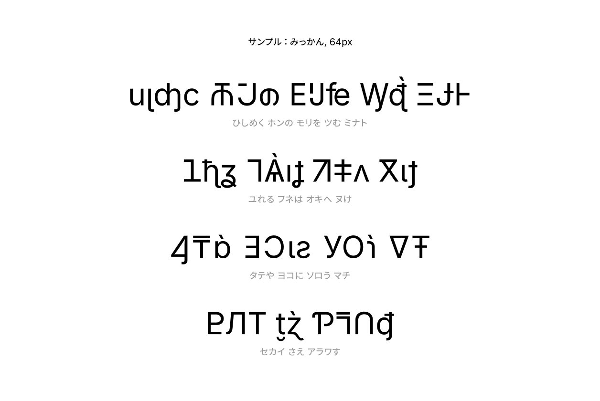
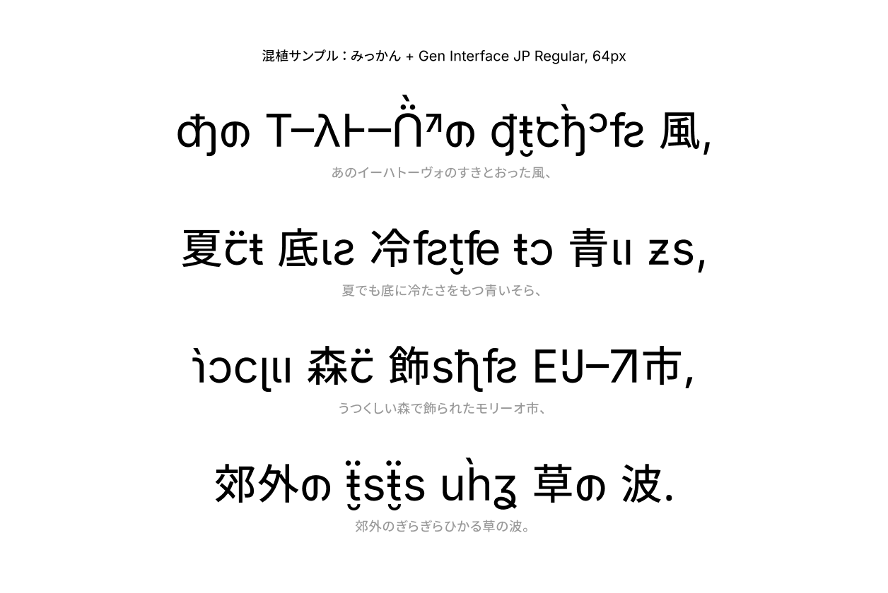

# Mìkam Kana みっかん

<!-- Version begin -->Version 4.001; Inter Version 4.001+git-9221beed3<!-- Version end -->

> **mìkam** *adp.* \[mɪ.ˈkam\] between.

> **みっかん** 3⃣ 〔mìkam〕（両者）の間に。

Mìkam Kana is a Japanese Kana font built from a patchwork of [Inter](https://rsms.me/inter), to design Japanese Hiragana and Katakana characters that resemble the appearance of Latin-Cyrillic-Greek letters in a Neo-Grotesque Sans-Serif style. The inspiration of the font is to develop a reverse font of [Electroharmonix](https://www.dafont.com/electroharmonix.font), a font that designs Latin letters in a style that resembles the appearance of Japanese Hiragana and Katakana characters. It is known as the font that “only Japanese people can’t read”. Despite the fact that Mìkam Kana is conceptually a reverse font of Electroharmonix, due to the fact that most Japanese speakers can also read Latin alphabets, Mìkam Kana has ended up being an “exotic and cryptic” font.

The name Mìkam, which means “between”, is both a reference to the fact that the font is designed to be a “between” of Latin and Japanese characters, and also a reference to the name of the base font *Inter*.

『みっかん』は、[Inter](https://rsms.me/inter) のもとにつぎはぎして作られた、ローマ字ゴシック体風の仮名フォントである。インスピレーションは、カタカナに見えるローマ字フォントで、かの有名な「日本人だけが読めないフォント」として知られている [Electroharmonix](https://www.dafont.com/electroharmonix.font) の逆バージョンのようなフォントを作りたかったのですが、いかんせん日本語話者は皆おおむねローマ字も読めるため、普通に暗号フォントのようなものを作ってしまいました。

フォント名の「みっかん」は、「両者の間に」（between）という意味で、フォントがローマ字と仮名の「間」に位置することを表すとともに、ベースフォントである Inter へのオマージュでもあります。

## Glyph Coverage 収録範囲

This font covers space and the following hiragana, katakana, and selected punctuation characters. 
Recommended pairing fonts: [Inter](https://rsms.me/inter), [Gen Interface JP](https://gen.typesetting.jp/), [Source Han Sans](https://github.com/adobe-fonts/source-han-sans).

このフォントは、スペースと下記のひらがな、カタカナ、および一部の約物を収録しています。
推奨の混植フォント：[Inter](https://rsms.me/inter)、[Gen Interface JP](https://gen.typesetting.jp/)、[源ノ角ゴシック](https://github.com/adobe-fonts/source-han-sans)。

> ぁあぃいぅうゔぇえぉお
> ゕかがきぎくぐゖけげこご
> さざしじすずせぜそぞ
> ただちぢっつづてでとど
> なにぬねの
> はばぱひびぴふぶぷへべぺほぼぽ
> まみむめも
> ゃやゅゆょよ
> らりるれろ
> ゎわゐゑをんゝゞ
> ァアィイゥウヴェエォオ
> ヵカガキギㇰクグヶケゲコゴ
> サザㇱシジㇲスズセゼソゾ
> タダチヂッツヅテデㇳトド
> ナニㇴヌネノ
> ㇵハバパㇶヒビピㇷフブプㇸヘベペㇹホボポ
> マミㇺムメモ
> ャヤュユョヨ
> ㇻラㇼリㇽルㇾレㇿロ
> ヮワヷヰヸヱヹヲヺ
> ンヽヾ
> ー・゠◌゙◌゚゛゜◌

## License ライセンス

> Copyright (c) 2026 Eana Hufwe, 1A23 Studio (https://1A23.studio)
> Copyright (c) 2016 The Inter Project Authors (https://github.com/rsms/inter)
>
> This Font Software is licensed under the SIL Open Font License, Version 1.1.
> This license is in this repo LICENSE.md, and is also available with a FAQ at:
> https://openfontlicense.org
>
> このフォントソフトウェアは、SIL Open Font License, Version 1.1 のもとでライセンスされています。
> このライセンスはこのリポジトリの LICENSE.md に記載されており、FAQ とともに https://openfontlicense.org にも公開されています。
